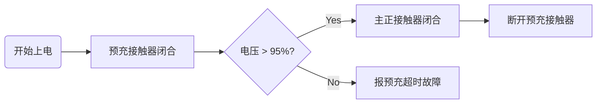

# Hardware-Design-Notes
Record BEC design experience
#高压配电盒 (PDU) 集成设计笔记  <-- 一级标题（项目名）

## 1. 项目概述  <-- 二级标题
本项目负责 **800V 平台** 的高压电流分配与保护。核心目标是实现 *ASIL-C* 级的功能安全。

*   **额定电压：** 800VDC
*   **峰值电流：** 900A (持续 30s)
*   **防护等级：** IP67

> **安全警告：** 调试高压系统时，必须确保放电电路工作正常，电压降至 60V 以下方可开盖。 <-- 引用（用于警告）
### 核心接触器选型对比

| 关键参数 | 供应商 A (陶瓷密封) | 供应商 B (充气式) | 结论 |
| :--- | :---: | :---: | :--- |
| 额定电流 | 400A | 500A | 选 B |
| 极限分断 | 2000A | 2500A | B 更优 |
| 成本 (RMB) | ¥90 | ¥100| A 更有优势 |

### 预充回路计算
预充电阻 $R$ 的选取需满足预充时间 $t < 200ms$：

$$t = -R \cdot C \cdot \ln(1 - \frac{V_{pre}}{V_{bat}})$$

其中 $C$ 为后端支撑电容，$V_{pre}$ 为预充目标电压。




# 简单的铜排温升估算脚本
```python
def calc_temp_rise(current, resistance, surface_area):
    power = (current ** 2) * resistance
    temp_rise = power / (surface_area * 0.0012) # 简化系数
    return temp_rise

print(f"预计温升: {calc_temp_rise(300, 0.0001, 5000)} K")
```
